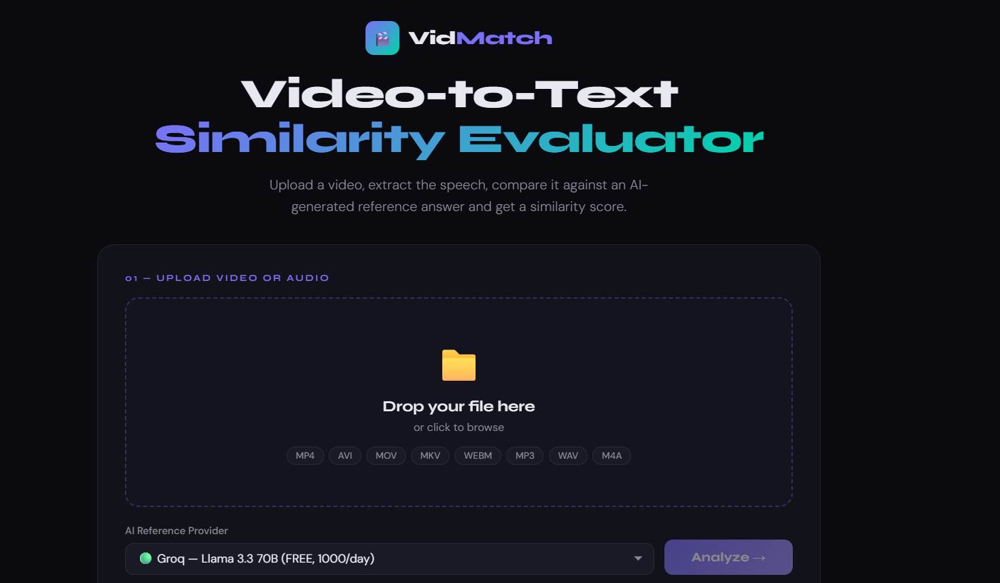
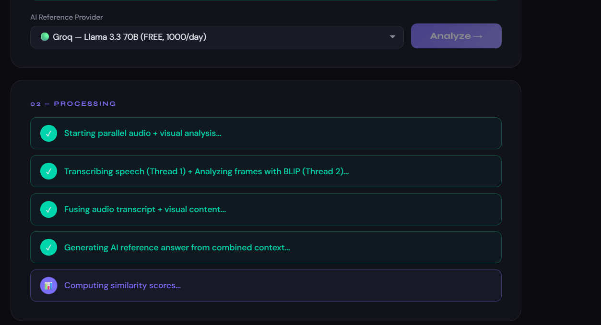
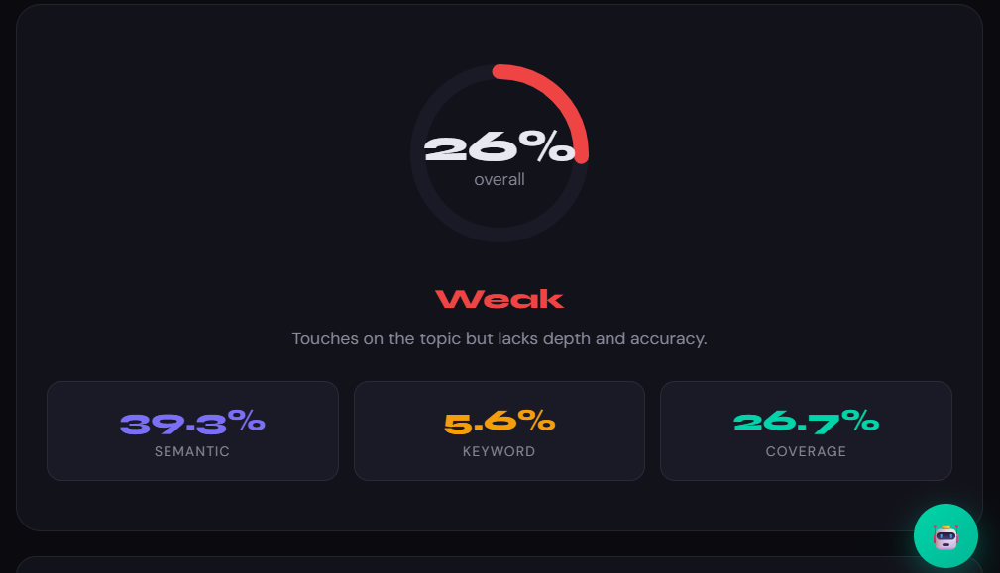
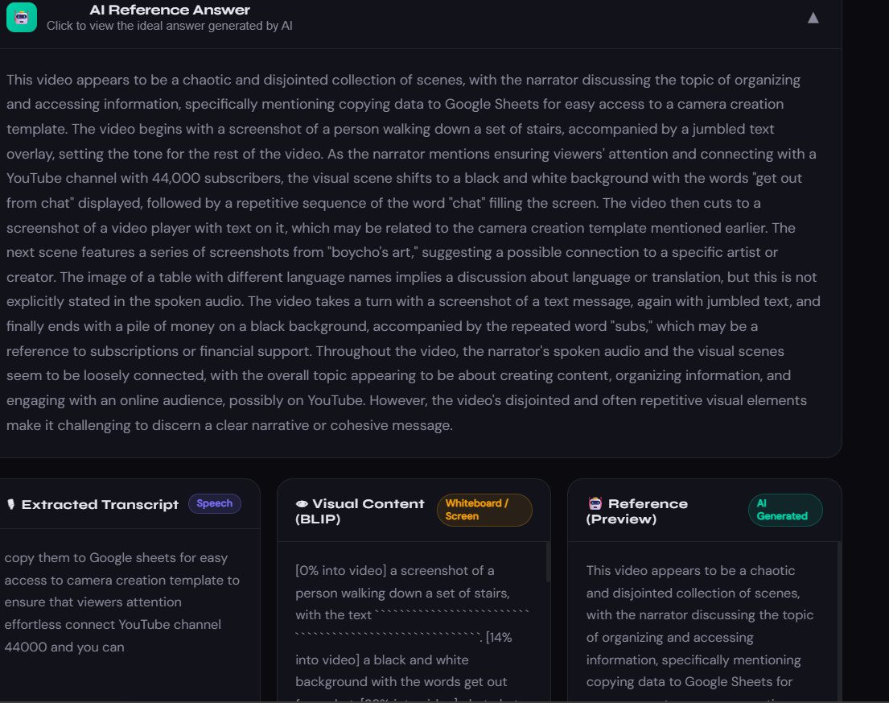

# 🎬 VidMatch — AI Video Explanation Similarity Evaluator

VidMatch is an **AI-powered multimodal system that evaluates how closely a video explanation matches an ideal reference answer.**

The system analyzes both **spoken audio and visual content** from a video, generates an expert-level reference explanation using **large language models**, and computes similarity scores between the original explanation and the generated reference.

This enables automatic evaluation of:

* Educational explanations
* Lecture videos
* Student presentations
* Training materials

---

# 📸 Demo

## Interface



## Processing Pipeline



## Evaluation Result



## Multimodal Analysis



---

# 🚀 Key Features

### 🎙 Speech Recognition Pipeline

Extracts and transcribes speech from uploaded videos.

### 👁 Visual Content Analysis

Uses the **BLIP vision model** to analyze frames for:

* text
* diagrams
* whiteboard content
* slides

### 🔀 Multimodal Fusion

Combines **speech transcript and visual descriptions** into a unified contextual representation.

### 🤖 AI Reference Answer Generation

Generates an ideal explanation using LLMs such as:

* **Llama 3.3 (Groq)**
* **OpenAI GPT**
* **Google Gemini**
* **Anthropic Claude**

### 📊 Similarity Evaluation

Computes multiple similarity metrics:

* **TF-IDF Cosine Similarity**
* **Keyword Overlap (Jaccard)**
* **Coverage Ratio**

### 🌐 Interactive Web Interface

Upload a video, run the analysis, and visualize the results in an interactive dashboard.

---

# 🧠 System Architecture

```
Video Input
     │
     ▼
Audio Pipeline ──► Speech Recognition
     │
     ▼
Visual Pipeline ─► Frame Extraction → BLIP Captioning
     │
     ▼
Multimodal Fusion
     │
     ▼
LLM Reference Answer Generation
     │
     ▼
Similarity Scoring
     │
     ▼
Web Interface Results
```

---

# 🛠 Tech Stack

## Backend

* Python
* Flask
* SpeechRecognition
* scikit-learn
* NumPy

## AI Models

* BLIP Image Captioning
* Llama 3 (Groq)
* OpenAI GPT
* Google Gemini
* Anthropic Claude

## Video Processing

* ffmpeg
* moviepy

## Frontend

* HTML
* CSS
* JavaScript

---

# 📂 Project Structure

```
video_similarity_app/
│
├── docs/               # Screenshots used in README
│   ├── interface.png
│   ├── processing.png
│   ├── results.png
│   └── analysis.png
│
├── templates/
│   └── index.html      # Frontend interface
│
├── app.py              # Main Flask backend
├── run.py              # Server launcher
├── setup.py            # Setup script
├── requirements.txt    # Python dependencies
├── .env.example        # Configuration template
├── .gitignore
└── README.md
```

---

# ⚙️ Installation

## 1️⃣ Clone the repository

```bash
git clone https://github.com/YashovardhanReddy001/video_similarity_app.git
cd video_similarity_app
```

---

## 2️⃣ Install dependencies

```bash
python setup.py
```

or

```bash
pip install -r requirements.txt
```

---

## 3️⃣ Install FFmpeg

FFmpeg is required for audio extraction.

### Windows

```bash
winget install ffmpeg
```

Verify installation:

```bash
ffmpeg -version
```

---

# 🔑 Configure API Keys

Create a `.env` file based on `.env.example`.

Example:

```
AI_PROVIDER=groq
GROQ_API_KEY=your_api_key_here
```

Supported providers:

* Groq (Llama 3)
* OpenAI
* Google Gemini
* Anthropic

---

# ▶️ Running the Application

Start the server:

```bash
python run.py
```

Open your browser:

```
http://localhost:5000
```

Upload a video and start analysis.

---

# 📊 Similarity Metrics

| Metric              | Method             | Weight |
| ------------------- | ------------------ | ------ |
| Semantic Similarity | TF-IDF Cosine      | 50%    |
| Keyword Overlap     | Jaccard Similarity | 35%    |
| Coverage Ratio      | Length Comparison  | 15%    |

---

# 🎯 Use Cases

* Automated evaluation of student presentations
* Lecture quality analysis
* Educational content benchmarking
* AI-assisted grading systems
* Training evaluation systems

---

# 📌 Future Improvements

* Transformer-based semantic similarity models
* Multilingual speech recognition
* Automatic concept extraction
* Dataset-based benchmarking
* Real-time lecture evaluation

---

# 📜 License

MIT License

---

# 👨‍💻 Author

**Yashovardhan Reddy**

GitHub
https://github.com/YashovardhanReddy001
